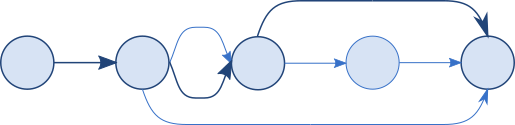

<!--
TMLPersistentContainer
README.md
Distributed under the ISC license, see LICENSE.
-->

# TMLPersistentContainer


Automatic shortest-path multi-step Core Data migrations in Swift.



A set of Swift extensions to Core Data's `NSPersistentContainer` and
`NSPersistentCloudKitContainer` that automatically detect and perform
multi-step store migration using the shortest valid sequence of migrations.
The library supports both light-weight and heavy-weight migrations, multiple
stores, progress reporting, and configurable logging.

## Example

Minimally replace the call to `NSPersistentContainer.init` or
`NSPersistentCloudKitContainer`:

```swift
container = PersistentCloudKitContainer(name: "MyStore",
                                        managedObjectModel: model)
```

Additional parameters optionally enable more features:

```swift
container = PersistentContainer(name: "MyStore",
                                managedObjectModel: model,
                                bundles: [Bundle.main, myResBundle],
                                modelVersionOrder: .list("V_One", "V_Two", "V_Six"),
                                logMessageHandler: myLogHandler)
container.migrationDelegate = self
```

All migrations happen as part of `NSPersistentContainer.loadPersistentStores`.

## Documentation

* [User guide](https://johnfairh.github.io/TMLPersistentContainer/usage.html) and
[API documentation](https://johnfairh.github.io/TMLPersistentContainer/) online.
* Or in the docs/ folder of a local copy of the project.
* Docset for Dash etc. at [docs/docsets/TMLPersistentContainer.tgz](https://johnfairh.github.io/TMLPersistentContainer/docsets/TMLPersistentContainer.tgz)
* Read `TestSimpleMigrate.testCanMigrateV1toV3inTwoSteps` for an end-to-end
  example.


## Requirements

Swift 6 or later, Xcode 16 or later.
* See the *swift31* branch for a Swift 31 version.
* See the *swift4* branch for a Swift 4 version.
* See the *swift41* branch for a Swift 4.1 version.

The library is based on `NSPersistentContainer`.  The minimum deployment targets
are iOS 12.0, macOS 10.14.6, tvOS 12.0, and watchOS 3.0.

The `PersistentCloudKitContainer` class is based on
`NSPersistentCloudKitContainer` so further requires a minimum deployment target
of iOS 13.0, macOS 10.15, tvOS 13.0, or watchOS 6.0.`

No additional software dependencies.

## Installation

Swift package manager:

    .Package(url: "https://github.com/johnfairh/TMLPersistentContainer/", majorVersion: 6)

Carthage:

    github "johnfairh/TMLPersistentContainer"

## Contributions

Contributions and feedback welcome: open an issue / johnfairh@gmail.com / @johnfairh@mastodon.social

## License

Distributed under the ISC license.
